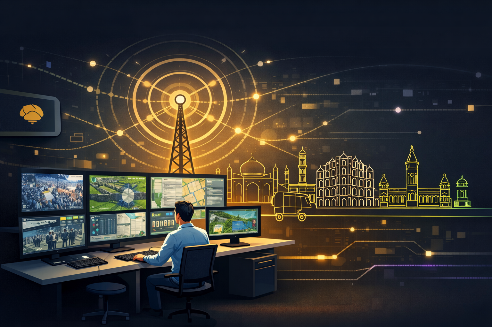
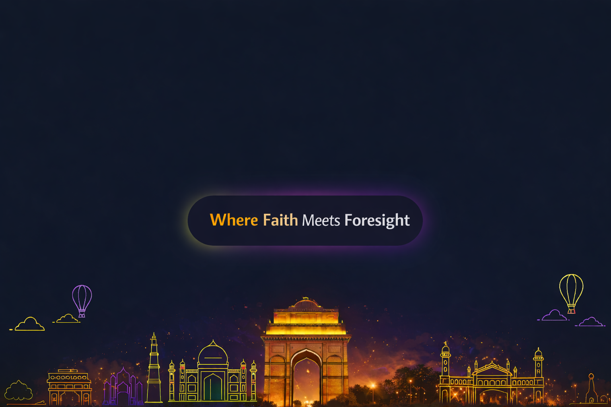
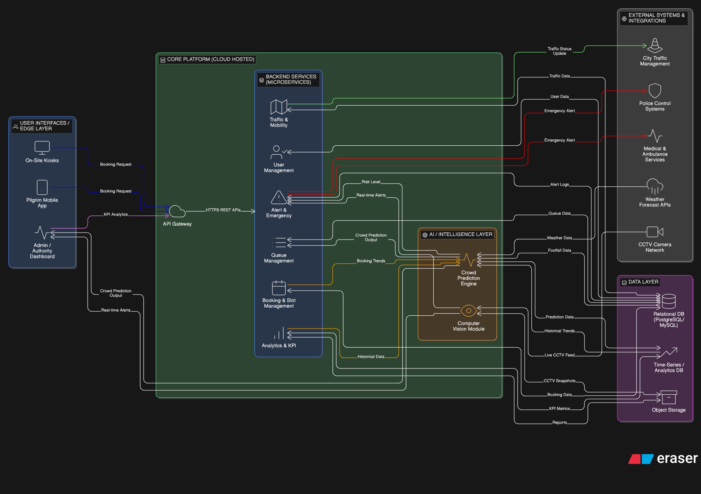
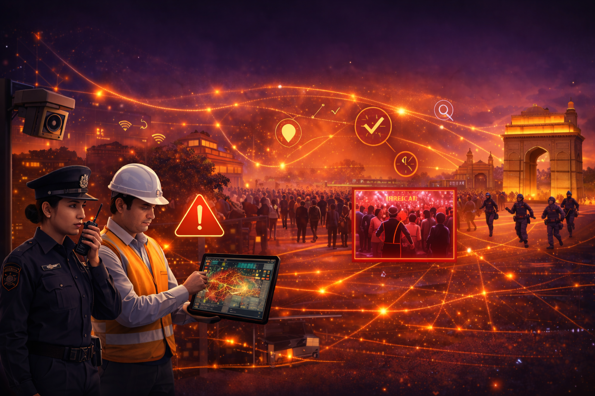
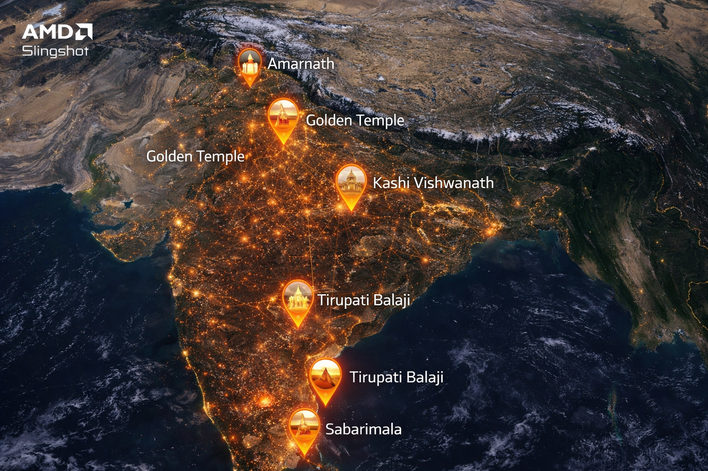

🛕 AI-Powered Temple & Pilgrimage Crowd Management System

  

📌 Overview
Large-scale religious gatherings often face:
  🚨 Sudden crowd surges
  ⏳ Long waiting times
  🚦 Traffic bottlenecks
  🔍 Security risks
  ⚠️ Delayed emergency response
This solution introduces proactive crowd & security intelligence powered by AI, IoT, and accelerated computing — transforming crowd management into a predictive, real-time ecosystem.

🎯 The Vision
  -> A scalable, AI-driven system that:
  -> Forecasts crowd surges before they happen
  -> Detects suspicious movements in real-time
  -> Enables automated alerts & intelligent dashboards
  -> Ensures safer pilgrimage experiences across India

  

🎬 Demo Prototype Video
  🔗 https://x.com/i/status/2027668103883378983

  

🛰 System Architecture
  -> 📹 Live CCTV feeds
  -> 🌡 IoT sensors (occupancy, environment)
  -> 🤖 AI/ML prediction models
  -> 📊 Admin dashboards
  -> 🚑 Emergency response routing
All accelerated using AMD-powered infrastructure.

  

🚀 Key Features
  -> 📊 Real-time crowd density monitoring
  -> 🔮 30-minute surge prediction
  -> 🧠 Suspicious movement & anomaly detection
  -> 🚨 Automated severity-based alerts
  -> 🗺 Dynamic queue & traffic management
  -> 📈 Historical analytics & heatmaps
  -> 👮 Role-based access (Admin, Authority, Security)
  -> ☁️ Scalable containerized deployment

  

⚙️ Technology Stack
  🖥 Frontend
  -> Flutter (Mobile App)
  -> React (Admin Dashboard & Kiosk)
  🧩 Backend
  -> FastAPI (High-performance APIs)
  -> RESTful services
  🤖 AI / ML
  -> Computer Vision (OpenCV / YOLO)
  -> Crowd Prediction Models
  -> Time-series forecasting
  🗄 Data
  -> PostgreSQL / SQLite
  -> Analytics engine for historical trends
  🔐 Security
  -> JWT Authentication
  -> Role-Based Access Control (RBAC)

  

💻 Usage of AMD Products / Solutions
  -> ⚡ AMD EPYC™ Processors – Backend API & database acceleration
  -> 🚀 AMD Instinct™ GPUs – AI model inference & video analytics
  -> 🧠 ROCm™ Platform – Deep learning optimization
  -> ☁️ AMD-powered scalable infrastructure
Enables:
-> Low-latency video processing
-> High-throughput prediction workloads
-> Real-time anomaly detection

  

🛰 Satellite Intelligence Layer
  AI-connected pilgrimage sites across India for centralized monitoring and prediction.

📊 Dashboard Preview
  -> Live crowd density heatmaps
  -> Real-time alert panel
  -> Suspicious activity detection
  -> Predictive surge graph

🛡 Security Intelligence
  -> Anomaly detection
  -> Suspicious movement tracking
  -> Emergency routing visualization

  

🏗 Scalability
  -> Kumbh Mela
  -> Vaishno Devi
  -> Tirupati
  -> Kashi Vishwanath
  -> Sabarimala
  -> National-level mass gatherings

🧠 Unique Selling Proposition (USP)
  Proactive crowd and security intelligence that predicts risks before they happen — not after.

👨‍💻 Author
Pratyush Dutta
Built with ❤️. 
Also, if you like this idea, please don't forget to give a star ⭐!
